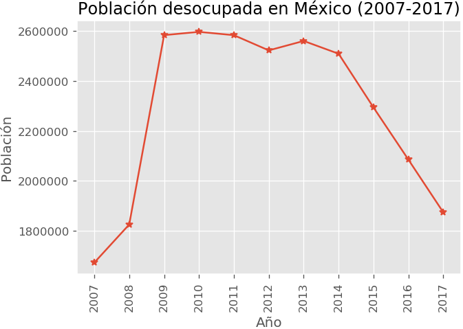
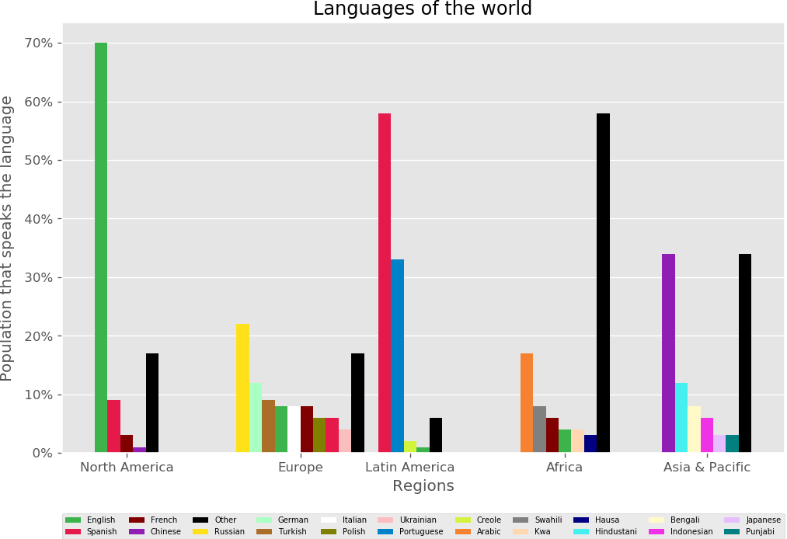
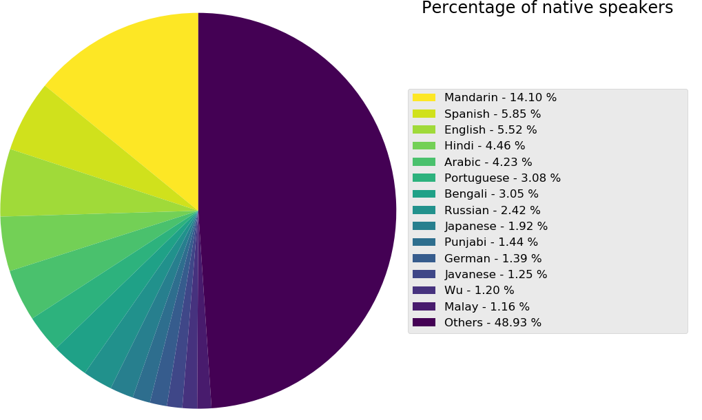
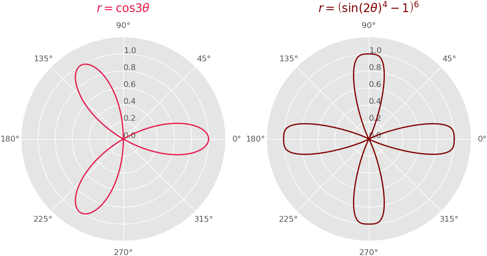
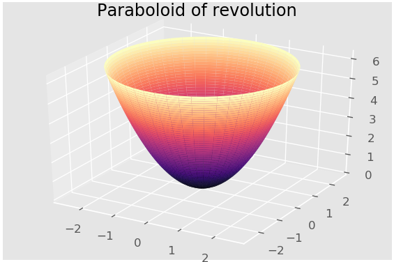
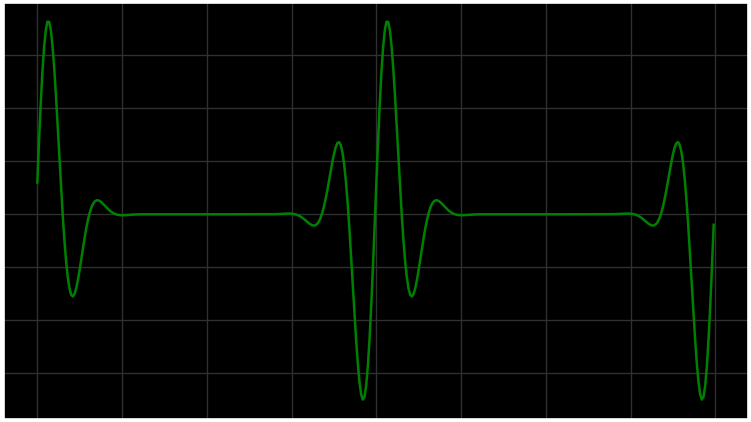

Desempleo en México, Idiomas del mundo, coordinadas polares, sólidos de revolución y gráficas animadas
======================================================================================================

Desempleo en México
-------------------

En México, el Instituto Nacional de Estadística y Geografía (INEGI) se encarga de realizar la Encuesta Nacional de Ocupación y Empleo (ENOE). Uno de los marcadores contemplados en esta encuesta es la población desocupada, que se mide como una tasa porcentual relativa a la población económicamente activa (PEA). Según la publicación “Cómo se hace la ENOE” del INEGI:

> La ENOE se basa en el marco normativo de los sistemas de contabilidad nacional para determinar quiénes realizan una actividad económica y quiénes no:
>
> -   Si la forma de vida de un individuo se vincula con la generación de valor agregado e implica con ello contribuir a la oferta nacional de bienes y servicios (públicos o privados, legales o ilegales), se considera que sí realiza una actividad económica y que, por ende, es un ocupado.
>
> -   Si la forma de vida de un individuo se enfoca sólo a capitalizar una redistribución de ingresos o de bienes por la vía de la mera transferencia a través de distintos mecanismos (limpiar parabrisas, pedir limosna), se considera que no realiza una actividad económica. Por definición, un servicio no es solicitado, significa que no es objeto de demanda por parte de la sociedad, y al no participar de una auténtica transacción, el prestador queda fuera del ámbito de la ocupación, pese a que él considere que lo que hace es un trabajo (técnicamente la persona participa de una transferencia unilateral en su beneficio mediada por un acto simbólico o un protocolo de comunicación con el donante, rasgo que es lo único que distingue al acto de un robo o un asalto). En la ENEU-ENE no existía esta distinción, así que se dejaba en manos del declarante su clasificación como ocupado o no ocupado.
>

A continuación, se muestra una gráfica que toma el promedio anual de la población desocupada nacional (serie unificada con criterios de la ENOE) para los años 2007 a 2017, promedio obtenido usando los reportes trimestrales publicados por el INEGI.

Languages of the World
----------------------

Next, using bab.la’s “Languages of the World” map, we graphed the predominance of languages by region:

And then, we graphed the global predominance of languages across the world using data from the 2007 edition of the Nationalencyklopedin:

Polar coordinates
-----------------

We graphed the functions *r* = cos(3*θ*) and *r* = ((2*θ*)−1)6 using polar coordinates.

Solids of revolution
--------------------

We graphed a paraboloid of revolution from the paraboloid family, using the following parametric equation: $P = \\left\\{ \\tilde{x} \\in \\left. \\ \\mathbb{R}^{3};u,v \\in \\mathbb{R} \\right|\\hat{x} = \\left( \\sqrt{u}\\cos\\left( v \\right),\\sqrt{u}\\sin\\left( v \\right),u \\right);\\ u \\geq 0;v \\in \\lbrack 0,2\\pi) \\right\\}$

Heartrate monitor animation
---------------------------

Lastly, we used the following function *f*(*x*) = exp(−20(mod(*x*+1,2,−1)2) sin(20mod(*x*+1,2)−1) to model heartbeats.

File tree
---------

Next, we'll provide general information about the included files and packages, but please refer to the full documentation and source files for a more in-depth explanation:

### `src/`

1.  `ninth/` This package provides rendering scripts that use pandas and matplotlib to create the figures described on the ninth lab practice's specifications.
2.  `main.py` is the main file. It runs basically all the render operations within **ninth**, and produces a total of 6 PNG's and 1 MPEG-4. The script is run from the root directory as usual (`python src/main.py`).

### `media/`

This directory might be empty if you haven't run the program. It's meant to be the output folder for the render operations this program performs.

Bibliographgy
-------------

-   ["ENOE: Población desocupada" - *INEGI*, 2005-2017](https://goo.gl/21duJH)
-   ["Languages of the World" - *bab.la*, 2017](http://4chanint.wikia.com/wiki/File:World-language-map-bab.la-1-.jpg)
-   ["The World's 100 Largest Languages in 2007" - *Nationalencyklopedin*, 2007](https://goo.gl/tLfvST)

Acknowledgements
----------------

For more information on the tools used to build, create and run this program refer to the following links:

-   [Python](https://www.python.org/) was the only language used for this project.
-   [JetBrains' PyCharm](https://www.jetbrains.com/pycharm/) was used as the primary editor.
-   [Graph Online](https://www.desmos.com/calculator) was used as a graphing tool to check the functions we modeled before coding them.
-   [pandas](https://pandas.pydata.org/) was the data analisys library used to work with csv files.

